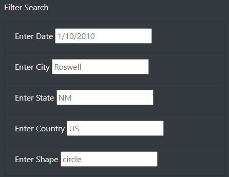
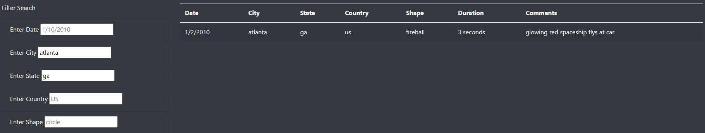

# ufos
Data Analysis Bootcamp - Week 11

## Overview of Project

The purpose of this project was to create a web page that displays a dynamic table, created with javascript then displayed via html, of UFO sightings that are catalogued in [data.js](static/js/data.js). For the module lesson we created a simple filter that allowed the user to filter the sightings by date. For the challenge afterwards we were asked to add additional filters for city, state, country, and shape that can be used in combination with each other.

## Data Sources

- [data.js](static/js/data.js)

## Results

> Describe how someone might use the new webpage by walking through the process of using the search criteria. Use images of your webpage during the filtering process to support your explanation.

You can filter this webpage by entering data into the input boxes following the format of the placeholder values that are there. When you load the page there will be light grey text in each box showing the desired format for your search. 

From there you can input your search criteria into one (or more) boxes. Shown below is an example where I filtered down to Atlanta, GA. You can see what values were changed by the color of the font. It's a little subtle, but the placeholder values are in a dark grey font and the typed in values are in black.

## Summary

> In a summary statement, describe one drawback of the new design created for the challenge and two recommendations for further development.

One drawback of the new design is that when you enter a filter box, the placeholders are still there in the other boxes. This could confuse the user into thinking that they are filtering to the placeholder values in other columns on top of what they've already printed. One possibility for further development is to update the text inputs to be passed in with ".toLowerCase()". It's natural for the user to want to type "Atlanta" so we should allow for that even though our table will eventually be filtered by "atlanta." Another possibility is to add a table of state abbreviations and allow the user to type in "ga" or "Georgia." For similar reasoning as above, it's reasonable for the user to not know the two letter abbreviation for any given state but still want the data from there.